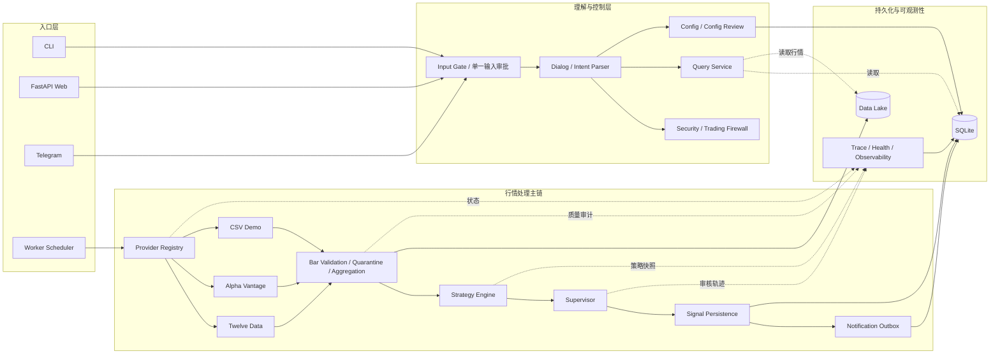
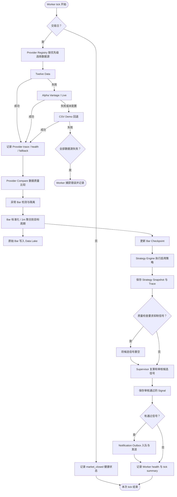
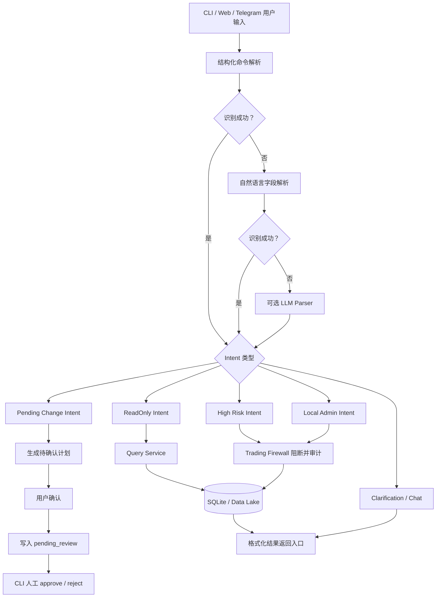

# Stock Agent 当前模块与执行 DAG

> 基于当前工作区代码生成。实线表示主数据流，虚线表示读取、审计或控制关系。

## 1. 系统级模块图



## 2. Worker 单次 Tick 的串行 DAG

这是当前最主要的自动运行链。`WorkerPipeline.run_once()` 每次执行一遍。



当前配置中的实际 Provider 顺序是：

```text
Twelve Data -> CSV Demo
```

Alpha Vantage 已有适配器，但不在当前 `provider.priority` 或 `fallback.order` 中，因此当前 Worker 不会自动调用它。

## 3. Agent / 查询链 DAG

Agent 负责理解、查询和提出配置变更，不负责定时抓取行情。



## 4. 当前模块职责

| 模块 | 主要职责 | 主输入 | 主输出 |
|---|---|---|---|
| `commands` / `cli.py` | 命令行入口和参数分派 | CLI 参数 | Command 调用 |
| `web` | FastAPI、Web Agent、SSE | HTTP 请求 | JSON/HTML/事件流 |
| `telegram` | Telegram 命令入口 | 聊天消息 | 查询或审核结果 |
| `dialog` | 结构化、自然语言、LLM 意图解析 | 用户文本 | Intent / Plan |
| `dialog/input_gate.py` | 唯一输入权、心跳、切换与原入口审批 | 三个交互入口 | 允许、阻断或切换状态 |
| `security` | 高风险交易和凭据访问阻断 | Intent | 放行或审计阻断 |
| `config` / `deployment` | 配置加载、验证、待审核变更 | YAML/环境变量 | Runtime Config |
| `worker` / `scheduler` | 周期调度、交易日判断、单实例运行 | Runtime Config | Tick Summary |
| `providers` | 行情源适配、选择、重试和回退 | 股票代码与周期 | 标准 `Bar` |
| `bars` | 校验、异常隔离、周期聚合 | 原始 `Bar` | 可供策略使用的 `Bar` |
| `strategies` | MA、MACD、KDJ、BOLL 等策略计算 | 标准 `Bar` | 候选 `Signal` |
| `signals` | 策略编排、快照与 Trace | `Bar` | Signal Pipeline Result |
| `supervisor` | 数据质量检查、信号复算和审核 | 候选 `Signal` | 通过/拒绝的 Signal |
| `notifications` | Outbox、重试和渠道发送 | 通过的 Signal | 通知记录 |
| `storage` | SQLite Repository、Data Lake | Bar/Signal/Trace | 持久化数据 |
| `query` / `knowledge` | 查询、统计和解释 | 查询 Intent | Query Result |
| `health` | 心跳、错误率、延迟和模块状态 | 运行指标 | Health Metric |
| `broker` | 券商能力接口和安全边界 | Broker Adapter | 行情能力；交易默认禁用 |
| `news` | 新闻 Provider 和查询 | 股票代码 | News Item |

## 5. 当前实现边界

- 行情抓取由确定性的 Worker 和 Provider 脚本执行，不由 Agent 自主抓取。
- 当前默认行情源是 Twelve Data，失败后回退 CSV Demo。
- Alpha Vantage 代码存在，但当前配置链没有启用。
- Web 后端路由已经存在，但 CLI 的 `stock-agent web` 启动命令尚未注册。
- `web/templates` 和 `web/static` 当前为空，Web 首页尚未完成。
- `poll_interval_sec` 尚未接入 Worker 的实际循环间隔。
